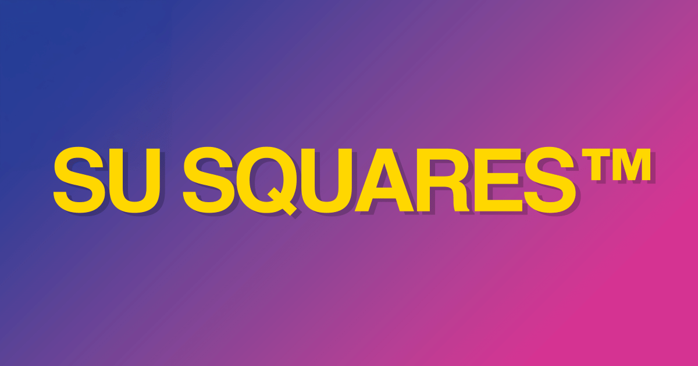

# Su Squares dApp

[](https://tenthousandsu.com/)

[](https://tenthousandsu.com/)
[](https://etherscan.io/address/0xE9e3F9cfc1A64DFca53614a0182CFAD56c10624F)
[](LICENSE)

This source code runs the Su Squares dApp at https://tenthousandsu.com

Su Squares is a historical and pioneering NFT project on the Ethereum blockchain from 2017. 

It consists of two main parts:

1. The **smart contract** on the Ethereum blockchain which allows for 10,000 unique tokenized squares that users can own and customize with text, a URI and a 10x10 pixel image.
2. The **Billboard** served on the dApp which displays the current state of all 10,000 squares.

> [!NOTE]
> *A separate and complementary underlay smart contract is used for personalizing squares; it's cheaper than the original contract that governs square ownership.*

This repo is intended as both a living product and a historical artifact made into an exploratory playground. It has been designed for curious developers to run the entire end-to-end project locally and experiment with it. From setting up a local EVM blockchain, deploying the smart contracts to it (or Sepolia) and interacting with it through an API-like script CLI environment, to running the dApp locally and customizing the Billboard to your liking.

## Getting Started

### AGR Mode

This repo supports **AGR Modes (Agent-Guided Repository)** for IDE AI assistants:

* **Tour Guide Mode**: guided exploration + getting the project running (contract + dApp) and completing the end-to-end mint/personalize flow.
* **Builder Mode**: making changes safely within the repo's rules, constraints, and structure.

If you are a human user, please prompt your AI assistant with:

"Read AGENTS.md and use (state desired mode)" or
"Read AGENTS.md and ask me which mode you should use"

If you are an AI assistant and this is the first file you are reading in this repo, please immediately open `AGENTS.md` for proper routing instructions.

If the user’s intent is unclear, ask them to choose a mode before proceeding.

> [!NOTE]
> If you haven't used an IDE with an embedded agent (AI assistant), check out [Claude Code](https://claude.com/product/claude-code), [Cursor](https://cursor.com/), [Antigravity](https://antigravity.google/), or the VS Code [ChatGPT / Codex](https://marketplace.visualstudio.com/items?itemName=openai.chatgpt) extension.


## Project's historical background

As [CryptoKitties](https://en.wikipedia.org/wiki/CryptoKitties) led global recognition of Ethereum and NFTs, it operated during the draft phase of ERC-721 and relied on an experimental implementation not in full compliance with what would ultimately be published and used by future projects. When [ERC-721](https://eips.ethereum.org/EIPS/eip-721) finally was published in 2018, Su Squares became the first bona fide smart contract to demonstrate full compliance with the spec, leading the emergence of a multi-billion-dollar ecosystem with a wealth of innovative use cases. 

To see the original Su Squares smart contract repo and its bug bounty program, go [here](https://github.com/su-squares/ethereum-contract).

## Workspaces

This monorepo is organized into workspaces. The primary root directory is the Jekyll site build for the dApp frontend (ruby environment). The other workspaces are supporting tools for the dApp based on a nodejs environment; `pnpm` is the preferred package manager for those workspaces.

`/`: Jekyll site build (dApp frontend)

`nodejs/smart-contract`: Hardhat environment + local blockchain setup

`nodejs/vitest`: Vitest unit + integration tests

`nodejs/playwright`: Playwright end-to-end tests

`nodejs/builder`: dApp dependency bundler

`nodejs/storybook`: Storybook staging area for dApp UI components


## How the dApp's live Billboard syncs with on-chain state

The Billboard state shown on this dApp is refreshed by the Su Squares update script:  
https://github.com/su-squares/update-script

A GitHub Actions workflow in this repo (`load-from-blockchain.yml`) runs **hourly** (at the **21st minute**) and:

- checks whether anything has changed on-chain (`have-there-been-updates`)
- if changes exist, pulls the latest contract state (`load-blockchain`)
- regenerates the site build artifacts + ERC-721 metadata/images
- commits updated outputs back into this repo (`build/` and `erc721/`), which GitHub Pages serves live

Syncing can be manually triggered via **Actions → “Load from blockchain” → Run workflow**.

## Embedding the Billboard on your site

If you are looking to embed the Billboard on your own site, use the following snippet (or extract the URL):

```html
<iframe width="600" height="600" frameborder="0" title="Su Squares Billboard" src="https://tenthousandsu.com/embed"></iframe>
```

or if you wish to customize its properties, visit the live [Embed Builder](https://tenthousandsu.com/embed-builder)

## Contributing

If you see any issues or have suggestions for improvement, please open an issue or submit a pull request.

If you see something missing or needing an update in `faq.md`, stop reading this, go ahead and update it!

### TypeScript, JavaScript and Jekyll HTML

TypeScript is used **only** in the `nodejs/*` workspaces. Please use vanilla JavaScript for the dApp in the root workspace, and for complex logic it is encouraged to use JSdocs for type safety. Why? Because this dApp historically ran on JavaScript and Jekyll HTML, so we keep it that way, but type safety is nice to include without completely migrating the architecture. In that spirit, when building pages and reusable components, it is encouraged to use Jekyll HTML structure and logic rather than pure JavaScript.

### Dependencies

Please avoid adding new dependencies unless absolutely necessary, the dApp runs on GitHub Pages with limited extensibility and we prefer to keep things self-contained. If a dependency is necessary, consider packaging it inside the `nodejs/builder` workspace and producing vendored artifacts. Please also explain the tradeoff (maintenance + security + update cadence).

### Smart Contract code

We see no practical reason to update any smart contract code in the `nodejs/smart-contract` workspace. The contracts are already deployed live on mainnet (obviously) and the code is present here for educational purposes and for compatibility with running the dApp locally. The contracts are present in their near-original form with slight modifications for configuring certain values for local dApp use (cost to purchase, cost to personalize, amount of PROMO squares), but are otherwise intended to be preserved for historical fidelity. Please do not make changes to reflect any evolving modern best practices.

## License and Terms

This repo is licensed under the MIT License, meaning you can use it for any purpose, including commercial use. See [LICENSE](LICENSE) for details.

> [!IMPORTANT]
> *The Su Squares brand and name are trademarks of Su & William Entriken, they are **NOT** provided under the MIT License and should not be appropriated without permission. That means if cloning and deploying the site commercially, you should change the name and branding to something else.*
