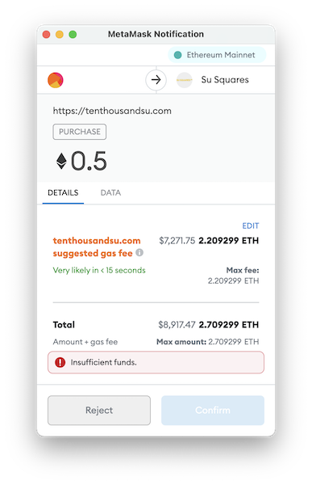

[Edit this page](https://github.com/su-squares/tenthousandsu.com/blob/master/faq.md)

# Frequently Asked Questions

*If you have a question, please mail [Su@TenThousandSu.com](mailto:Su@TenThousandSu.com?subject=Su Squares&body=Hi Su%2C Please help! I have a question about Su Squares. ).*

## How do I split a 30×30 image into 9 10×10 images?

First, get your image to be a square. On macOS you can do this:

1. Open the big image in Preview.app
2. Select a square area (select-drag)
3. Tools > Crop

Then scale your image down to 30×30 pixels. In Preview.app this is:

1. Tools > Adjust Size...
2. Set width to 30
3. Ensure Resample image is turned on
4. Save the file

Now you have a 30×30 file. You can turn this into 9 10×10 images using an online tool such as [PineTools&mdash;Split image online](https://pinetools.com/split-image).

Or if you are comfortable with the command line, use this command to transform a file named `in.png` the a folder named `SPLITME` on your desktop into 10×10 images (files are numbered in order left-to-right then top-to-bottom, just like the order words are printed in English books).

```sh
convert ~/Desktop/SPLITME/in.png -crop 10x10 ~/Desktop/SPLITME/out.png
```

## Why is gas cost ridonkulously high?

Because that Square is not available. You are attempting to place an order that will revert. MetaMask could do a much better job of articulating this.


